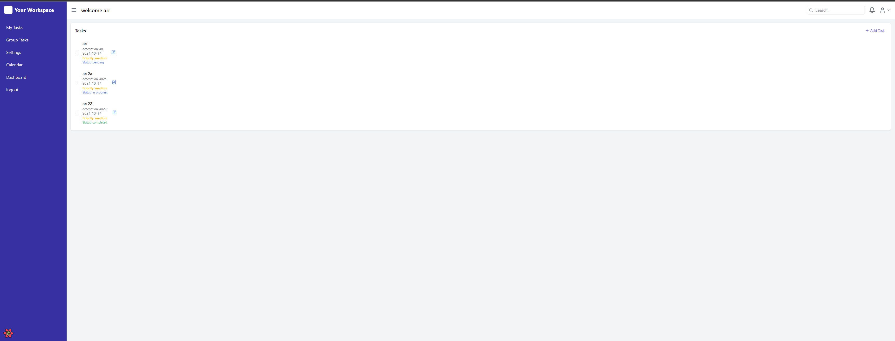

# Task Management Application

## Overview

This is a full-stack task management application built with React and Node.js. It offers a comprehensive suite of features for managing personal and group tasks, including a calendar view and an analytics dashboard.

## Features

- **Personal Task Management**: Create, edit, and delete personal tasks.
- **Group Task Management**: Collaborate on tasks within groups.
- **Calendar View**: Visualize tasks in a calendar format.
- **Dashboard**: Get insights into task completion rates and productivity trends.
- **User Authentication**: Secure login and registration system.
- **Real-time Updates**: Instant updates for task changes in group projects.

## Tech Stack

### Frontend
- React
- React Router for navigation
- Redux for state management
- Axios for API requests
- Recharts for data visualization
- React Big Calendar for the calendar view
- Tailwind CSS for styling

### Backend
- Node.js
- Express.js
- MongoDB for database
- Mongoose as ODM
- JSON Web Tokens (JWT) for authentication

## Getting Started

### Prerequisites
- Node.js (v14 or later)
- npm or yarn
- MongoDB

### Installation

1. Clone the repository:
   ```
   git clone https://github.com/ariel11212321/task-management.git
   cd task-management
   ```

2. Install backend dependencies:
   ```
   cd backend
   npm install
   ```

3. Install frontend dependencies:
   ```
   cd ../frontend
   npm install
   ```

4. Set up environment variables:
   - Create a `.env` file in the backend directory
   - Add the following variables:
     ```
     PORT=5000
     MONGODB_URI=your_mongodb_connection_string
     JWT_SECRET=your_jwt_secret
     ```

5. Start the backend server:
   ```
   cd backend
   npm start
   ```

6. In a new terminal, start the frontend development server:
   ```
   cd frontend
   npm start
   ```

7. Open your browser and navigate to `http://localhost:3000`

## API Documentation

The API documentation is available at `/api-docs` when running the backend server.

## Contributing

We welcome contributions! Please see our [Contributing Guide](CONTRIBUTING.md) for more details.

## License

This project is licensed under the MIT License - see the [LICENSE](LICENSE) file for details.

## Acknowledgments

- [React](https://reactjs.org/)
- [Node.js](https://nodejs.org/)
- [Express](https://expressjs.com/)
- [MongoDB](https://www.mongodb.com/)
- [Recharts](https://recharts.org/)
- [React Big Calendar](https://github.com/jquense/react-big-calendar)

[](images/login.png)
[](images/tasks.png)
[](images/dashboard.png)
[](images/calendar.png)
